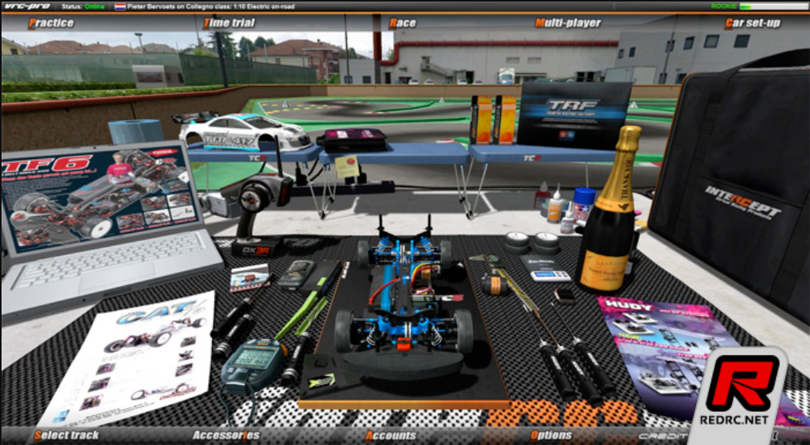

# VRC-PRO-Adapter

This program reads PWM signal from RC receiver and emulates a HID gamepad.

Support both 32U4 and SAM D21 boards.

Before compile and flash the program to your Arduino boards. Please install the hid library in the library.


Arduino混创客圈的人应该很熟悉了。

VRC PRO知道的人应该不多。

国内玩遥控赛车的人本身就少，玩遥控赛车模拟器的人估计就更少了。

其实我一直觉得遥控赛车对于小朋友甚至成年人都是一项不错的运动和爱好。

一是，遥控赛车是真人远程操作的比较安全。二是，虽然遥控赛车也不便宜，但玩起来比真车那是便宜不知道多少倍了。三是，遥控赛车相对来说是比较复杂的机电一体化系统。对于机械和电子感兴趣的朋友也是一种很好的入门的项目。

但是由于种种原因国内遥控赛车市场发展的并不好。不如日本和香港的玩车氛围，甚至还有很多地方有公益的玩车场地。不过这有点扯远了，以后有空再聊。

其实对于新人来说，玩RC最初的门槛就是钱。一辆大厂牌的1：10电房，动辄就要3000-4000。还没算电子和遥控器。如果要有一套能下地的真车没有小一万可能是不太行的。所以对于新手来说能有一个廉价的体验遥控赛车的机会，从而喜欢上遥控赛车。对遥控赛车这个运动的发展可能也是有一些好处的吧。这也算我写这篇文章的私心。

VRC PRO这个游戏可以去这里下载：[VRC World Portal](https://www.vrcworld.com/)。模拟器本身是不要钱的，只是赛道和赛车的数量有限制。对于新手来说其实不需要那么多赛道，所以成本算是0吧。买一个国产的地面遥控器加接收机应该最多100-200就够了。如果有以前不玩或者坏了的模型上面有遥控设备的也可以拆下来用。一块Arduino Micro淘宝上大概20-30吧。所以总共的成本应该不会超过300块，就可以体验遥控赛车了。当然也可以买成品的适配器，价格大概在90-200块。刷新率400-800hz。用Arduino自制的实际测试大概有600hz 左右。

Arduino混创客圈的人应该很熟悉了。

VRC PRO知道的人应该不多。

国内玩遥控赛车的人本身就少，玩遥控赛车模拟器的人估计就更少了。

其实我一直觉得遥控赛车对于小朋友甚至成年人都是一项不错的运动和爱好。

一是，遥控赛车是真人远程操作的比较安全。二是，虽然遥控赛车也不便宜，但玩起来比真车那是便宜不知道多少倍了。三是，遥控赛车相对来说是比较复杂的机电一体化系统。对于机械和电子感兴趣的朋友也是一种很好的入门的项目。

但是由于种种原因国内遥控赛车市场发展的并不好。不如日本和香港的玩车氛围，甚至还有很多地方有公益的玩车场地。不过做竞赛车辆的厂家日子也不好过；否则田宫不会取消TRF部门，京商不会已经被转了几手，yokomo也不会开始做漂移车了。RC的圈子尤其是赛车的圈子越来越小。不过这有点扯远了，以后有空再聊。

其实对于新人来说，玩RC最初的门槛就是钱。一辆大厂牌的1：10电房，动辄就要3000-4000。还没算电子和遥控器。如果要有一套能下地的真车没有小一万可能是不太行的。所以对于新手来说能有一个廉价的体验遥控赛车的机会，从而喜欢上遥控赛车。对遥控赛车这个运动的发展可能也是有一些好处的吧。这也算我写这篇文章的私心。

VRC PRO这个游戏可以去这里下载：[VRC World Portal](https://www.vrcworld.com/)。模拟器本身是不要钱的，只是赛道和赛车的数量有限制。对于新手来说其实不需要那么多赛道，所以成本算是0吧。



<aside>
💡 VRC PRO游戏界面

</aside>

买一个国产的地面遥控器加接收机应该最多100-200就够了。如果有以前不玩或者坏了的模型上面有遥控设备的也可以拆下来用。一块Arduino Micro淘宝上大概20-30吧。所以总共的成本应该不会超过300块，就可以体验遥控赛车了。当然也可以买成品的适配器，价格大概在90-200块。刷新率400-800hz。用Arduino自制的实际测试大概有600hz 左右。


从上图可以看到系统的简单架构。遥控器先获取转向角度和油门刹车的模拟量，然后通过无线发送给接收机。接收机收到后会将信号转换成模型舵机的PWM信号。一般会用1.5ms长度的脉冲作为中点，从1到2ms各为最小值和最大值。


<aside>
💡 模型舵机信号

</aside>

Arduino在这里的作用就是读取接收机输出的模型舵机PWM信号，然后模拟一个游戏手柄类的HID设备来控制模拟器（VRC PRO）。

HID是Human Interface Device的缩写。中文翻译过来就是人机交互设备。比如键盘，鼠标，游戏手柄等等都可以归为这类设备。很多带USB的MCU通过HID的库就可以模拟这些设备。所以说用这里的方法不仅是用来做接收机转换器，用来做客制化机械键盘其实也是可以的。

这里比较推荐的的是用ATmega 32U4的Arduino Micro（或者各种用一样u的盗版）。因为HID设备的库用得比较多而且齐全。当然如果手上有SAM D21处理器的朋友也不用担心，我也会提供相应的程序来下载。

下面来看下代码。

```
#include "HID-Project.h" //包含HID库
void setup() {
  pinMode(A0, INPUT_PULLUP); //设置A0为输入并拉高
  pinMode(A1, INPUT_PULLUP); //设置A1为输入并拉高
  attachInterrupt(digitalPinToInterrupt(A0),isr1,CHANGE);//设置A0在变化时产生中断isr1
  attachInterrupt(digitalPinToInterrupt(A1),isr2,CHANGE);//设置A0在变化时产生中断isr2
  // Sends a clean report to the host. This is important on any Arduino type.
  Gamepad.begin();//这里使用的是一个叫HID-Project库，在模拟游戏手柄前需要执行这个函数
}

volatile unsigned long Time[2];//用来存储时间
volatile unsigned int Value[2];//用来存贮PWM信号的值
volatile bool ValChanged[2];//用来作为值有没有变化的标志
void loop() {

    // Move x/y Axis to a new position (16bit)
    if (ValChanged[0]) //只有在通道0值变化时才像计算机更新信号
    {
      Gamepad.xAxis(Value[0]);//库函数更新x轴的值
      Gamepad.write();//库函数将值更新给计算机
      ValChanged[0] = false;//将数据变化标志清除
    }

    if (ValChanged[1])//只有在通道1值变化时才像计算机更新信号
    {
      Gamepad.yAxis(Value[1]);//库函数更新x轴的值
      Gamepad.write();//库函数将值更新给计算机
      ValChanged[1] = false;//将数据变化标志清除
    }
}

void isr1()//通道0中断函数
{
  if (digitalRead(A0)) Time[0] = micros();//如果A0信号被拉高的话记录当前时间
  else
  {
    Value[0] = micros()-Time[0];//如果A0信号被拉低的话计算PWM宽度
    ValChanged[0] = true;//设置数据变化标志
  }
}

void isr2()//通道1中断函数
{
  if (digitalRead(A1)) Time[1] = micros();//如果A0信号被拉高的话记录当前时间
  else
  {
    Value[1] = micros()-Time[1];//如果A0信号被拉低的话计算PWM宽度
    ValChanged[1] = true;//设置数据变化标志
  }
}

```

其实程序很简单。设置了两个中断来分别读取两个通道上的PWM信号宽度，一旦信号宽度有更新就通过HID给手柄的X轴和Y轴跟新数值。

上面的程序有一个小小的问题就是中断用的是Arduino自带的中断函数。应该没有直接操作硬件中断的效果好。不过实际测试的话报告率也可以达到大概600hz左右。所以我就懒得写新的了，有兴趣的同学可以自己查查看看要怎么写。

刷写的话很简单，在固件包里我分了俩目录，一个里面放的是给32U4板子的固件，另一个是给SAM D21的板子的固件。在刷固件之前请安装固件包里的HID库。然后选择自己的板子类型和串口就可以刷写程序了。


<aside>
💡 安装HID库的zip包

</aside>

刷完程序以后会有一个游戏控制器出现在windows的设备当中。


<aside>
💡 在设备和打印机中出现新的游戏控制器

</aside>

然后右击设备选择游戏控制器设置。


在弹出的菜单中点击属性。


再点击校准，根据步骤校准后就可以在游戏中使用这个转换器啦！


<aside>
💡 在游戏中选中控制器，一般操作的时候的刷新率能到600-700

</aside>